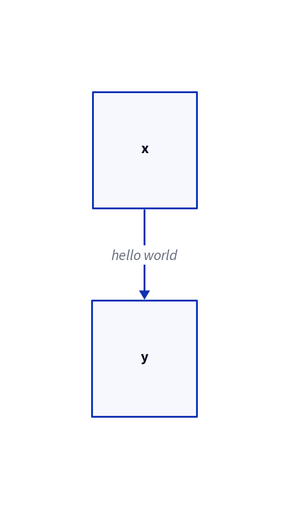
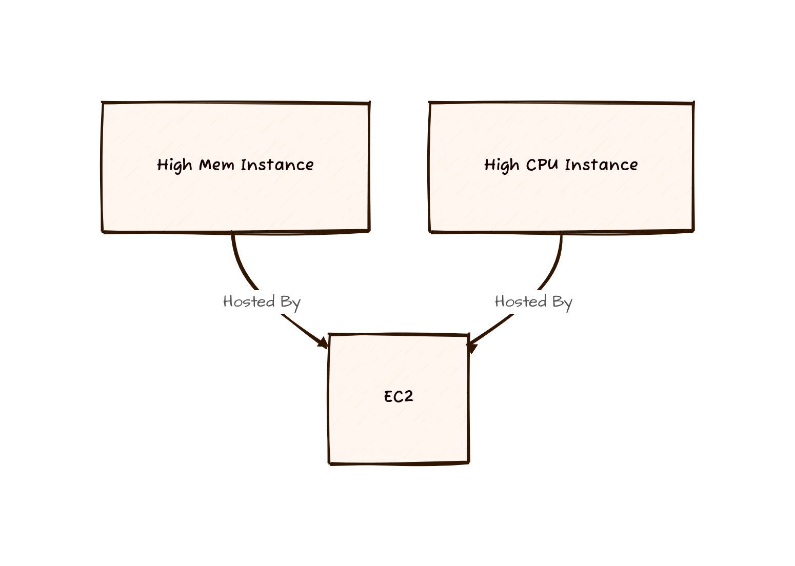
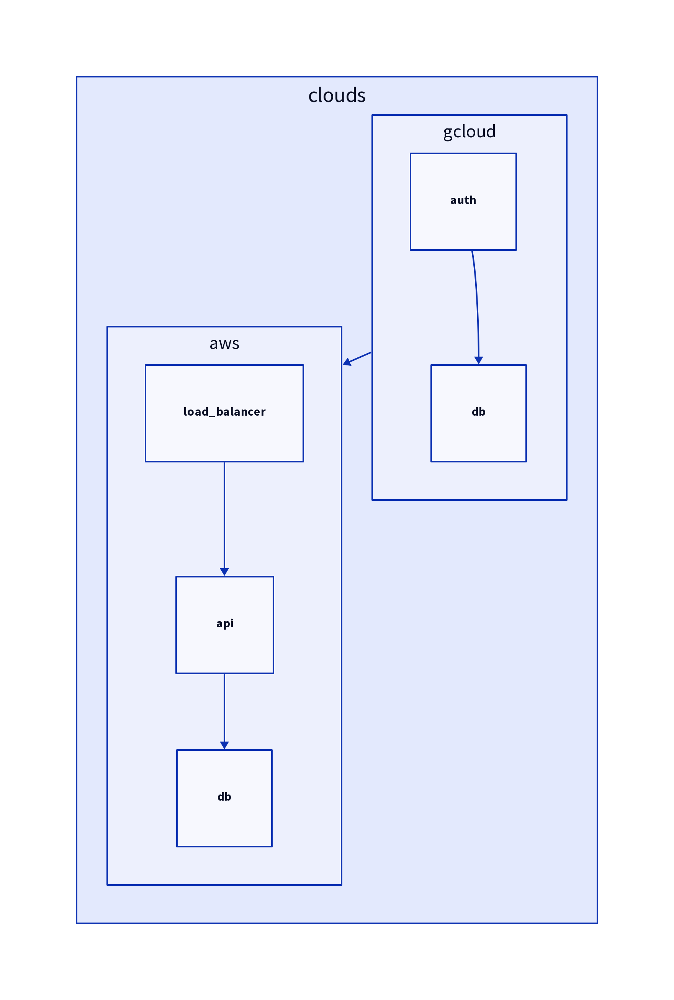

# ob-d2

## Introduction
`ob-d2` enables [Org-Babel](http://orgmode.org/worg/org-contrib/babel/intro.html) support for evaluating [d2](https://d2lang.com/tour/intro/) code.
It was created based on the usage of [ob-ditaa](https://orgmode.org/worg//org-contrib/babel/languages/ob-doc-ditaa.html).
The d2 code is compiled via the `d2` command.

```
#+BEGIN_SRC d2 :file hello.png
x -> y: hello world
#+END_SRC
```

<div>
  
</div>

## Language Specific Header Arguments

In addition to the normal header arguments for Babel, d2 uses the `:flags` header to pass additional flags to the `d2` command.
`:file` is required since the output of d2 is an image.

## Additional Examples
All courtesy of Terrastruct, Inc. who published these in their d2 documentation.

### Flags to specify theme and sketch format

```
#+BEGIN_SRC d2 :file flags.png :flags -t 101 -s
High Mem Instance -> EC2 <- High CPU Instance: Hosted By
#+END_SRC
```

<div>
  
</div>

### Complex example

```
#+BEGIN_SRC d2 :file complex.png
clouds: {
  aws: {
    load_balancer -> api
    api -> db
  }
  gcloud: {
    auth -> db
  }

  gcloud -> aws
}
#+END_SRC
```

<div>
  
</div>

## Installation
### manual
Download `ob-d2.el` from this repository to your loadpath and include `(require 'ob-d2)` in your `init.el` file.

### straight.el
Alternatively if you use [straight.el](https://github.com/raxod502/straight.el) as your package manager, you can point it directly to the repository.

```
(straight-use-package
 '(ob-d2 :type git :host github :repo "xcapaldi/ob-d2"))
```

Or in combination with `use-package`:


```
(use-package ob-d2
  :straight (ob-d2 :type git :host github :repo "xcapaldi/ob-d2"))
```

## Configure org-mode for d2 support
After loading `ob-d2` you'll need to enable d2 as a supported language in org-mode.
You should add it to `org-babel-load-languages`.
For example:

```
(org-babel-do-load-languages
   'org-babel-load-languages
   '((shell . t)
     (python . t)
     (d2 . t)))
```

If you use `use-package` you could use something like this:

```
(use-package org
  :after ob-d2
  :config
  (org-babel-do-load-languages
   'org-babel-load-languages
   '((shell . t)
     (python . t)
     (d2 . t))))
```

